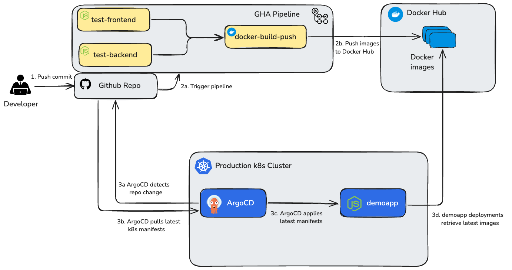

# k8s-demo-prod-app

Sample app to demonstrate 3-tier app deployment to Kubernetes.

## Features

## Features
  - **Infrastructure and applicaton code versioned together** 
    - Frontend, backend, and k8s manifests are versioned and tested together
    - Reduces release risk and complexity
  - **Automated deployment with ArgoCD**
    - Releases to `main` are automatically detected and deployed

## Structure & Usage

### Repo Structure

NOTE: This repo is intended to be used in conjunction with [k8s-demo-prod-infra](https://github.com/jtreutel/k8s-demo-prod-infra).  Please deploy the infrastructure contained in that plan before running this one.

The repo structure is as follows:

```
.
├── backend         Backend source code and Dockerfile
├── frontend        Frontend source code, assets, and Dockerfile
└── k8s_manifests   Kubernetes manifests
```

### CI/CD Overview



The CI/CD flow is as follows:

- Developer submits a pull request to `main`, kicking off two parallel processes:
  - GHA Pipeline flow
    - GHA pipeline is triggered, running tests and build
    - Built Docker images are pushed to Docker hub
  - ArgoCD deployment flow
    - ArgoCD detects a change in the repo's `main` branch
    - ArgoCD pulls the latest k8s manifests
    - ArgoCD applies the manifests
    - New `demoapp` deployments retrieve updated images from Docker hub


## Additional Context

### Assumptions 

  - Github
    - Branch `main` always contains deployable code
  - Target Kubernetes environment
    - Mongo credential secret created manually
    - Namespace `demoapp` has been created in the corresponding [infrastructure plan](https://github.com/jtreutel/k8s-demo-prod-infra)

### TODO

  - CI/CD
    - Write unit tests for frontend and backend
    - Add test commands and output to test job
    - Implement release tagging for use in ArgoCD
    - Implement Argo Rollouts for more fine grained deployment control
  - Security
    - Retrieve Mongo secret from GCP Secret Manager 
  - Kubernetes Manifests
    - Parameterize ingress base URL for reusability
  - General
    - Add instructions for setting up a local development environment